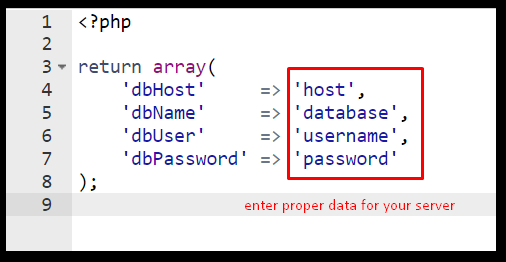

# Books Database Admin Panel
____
##### _pure PHP/MySQL project based on MVC pattern with CRUD functionality_
_completed on 31.03.2021 as a practical assignment for INVO LLC accepted on 26.03.2021_
___
* Admin dashboard template is taken from [Theme Forest - Atlant](https://themeforest.net/item/atlant-bootstrap-admin-template/9217590)
* Database dummy data is generated using [Fill Database](http://filldb.info/) 

